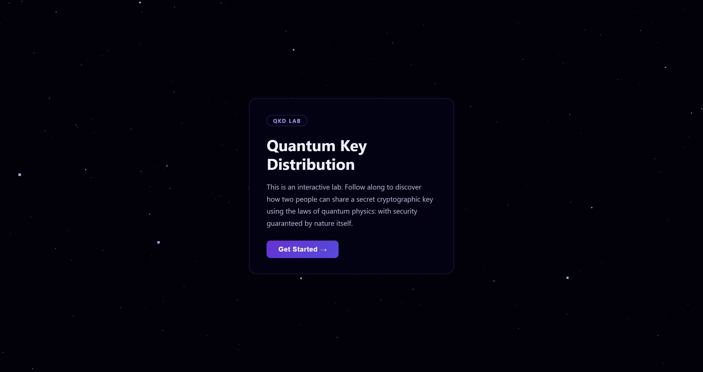
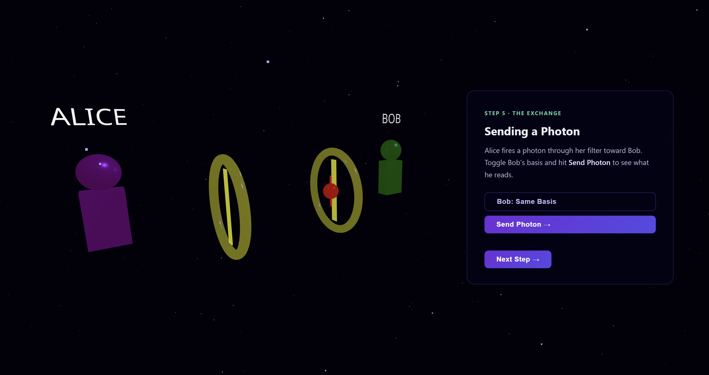
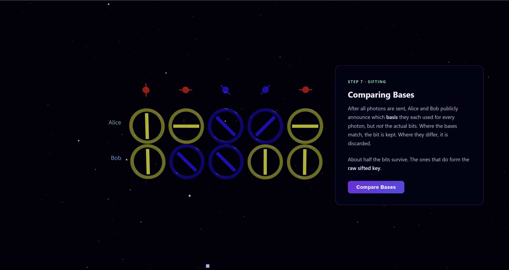

# Quantum Key Distribution — Interactive 3D Lab

An interactive educational visualization of the **BB84 quantum key distribution protocol**, built with Three.js and TypeScript. 
\nDemo link: https://youtu.be/25ePls7s1dI
\nSlides: https://www.canva.com/design/DAHGer-nMNM/eAP-viUlIJ85s3928spNCQ/edit





---

## What Is This?

The **BB84 protocol** is a quantum cryptography algorithm that lets two parties generate a provably secure shared key. Any eavesdropping attempt physically disturbs the quantum channel and becomes measurable. This project walks through the entire protocol in a step-by-step 3D simulation.

### The Protocol Steps

| Step | Description |
|------|-------------|
| 1 | **Alice** encodes bits as photon polarization states |
| 2 | **Photons** travel through the quantum channel |
| 3 | **Polarization** — four orientations across two measurement bases |
| 4 | **Filters** — Bob's measurement devices |
| 5 | **Photon Exchange** — Bob randomly chooses a basis to measure |
| 6 | **Bob** records his measurement results |
| 7 | **Sifting** — Alice and Bob publicly compare bases, discard mismatches |
| 8 | **Eve (Eavesdropper)** — intercepts photons and disturbs quantum states |
| 9 | **Error Detection** — QBER > 11% reveals eavesdropping |
| 10 | **Shared Key** — the remaining bits form a secret key |

---

## Technologies

| Library | Role |
|---------|------|
| [Three.js](https://threejs.org/) | 3D rendering via WebGL — scene, camera, lights, geometries |
| [GSAP](https://gsap.com/) | Animation — camera movement, object transitions, light flashes |
| [Troika Three Text](https://github.com/protectwise/troika/tree/main/packages/troika-three-text) | 3D text rendered directly in WebGL |
| [TypeScript](https://www.typescriptlang.org/) | Type safety across the entire codebase |
| [Vite](https://vite.dev/) | Dev server and bundler |


---

## Getting Started

### Prerequisites

- Node.js 18+
- npm

### Install & Run

```bash
# Navigate to the project folder
cd qkd

# Install dependencies
npm install

# Start the development server
npm run dev
```

Open your browser at `http://localhost:5173`.


---


## Interactive Controls

| Control | Action |
|---------|--------|
| Left-click + drag | Rotate camera |
| Scroll wheel | Zoom in/out |
| Right-click + drag | Pan camera |

---

